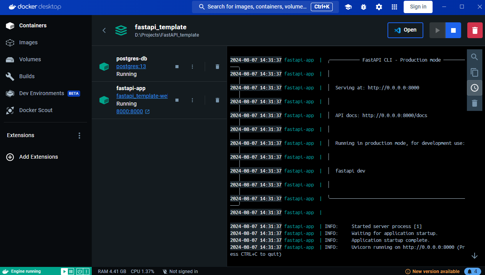
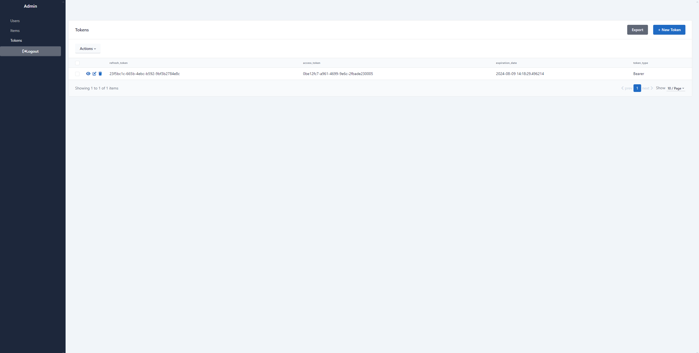
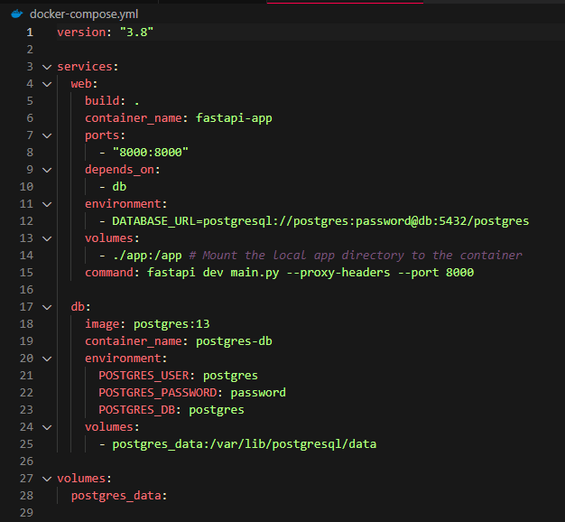
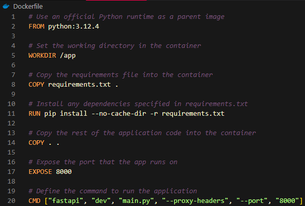

# ReadIt Backend

This project is a FastAPI application with Postgresql database.
For ease of development and/or learning, example code has been added to this project.

To start the example application, create `.env` file in `app/` directory (same as `main.py`) and enter one line:

`DB_URL=postgresql://postgres:password@db:5432/postgres`

## Application Deployment

To deploy this backend from template please use Docker Desktop.

After you've acquired Docker Desktop on your computer you can deploy using command (make sure application is being run with `run` argument, in case you're not sure see below in **Modes** section):

`docker-compose up --build`

Working application would look like this:

### Accessing Admin Panel

If you want to access Admin Panel, you need go to this link:

`http://127.0.0.1:8000/admin/login`

After logging in you'll get access to database.

## Development

### Hinting

If you want to develop this backend with hints you neeed to create virtual enviroment:

`python -m venv venv`

Then you can install all requirements by using:

`pip install --no-cache-dir -r requirements.txt`

### Modes

In order to use dev-mode (so that code can dynamically recompile, when code is changed), or change to production mode make sure that in `dockerfile` and `docker-compose.yml` application is being run with correct argument:

- `run` for **Production mode**
- `dev` for **Development mode**

In `docker-compose.yml` you need to edit line **15**.

In `dockerfile` you need to edit line **20**.

